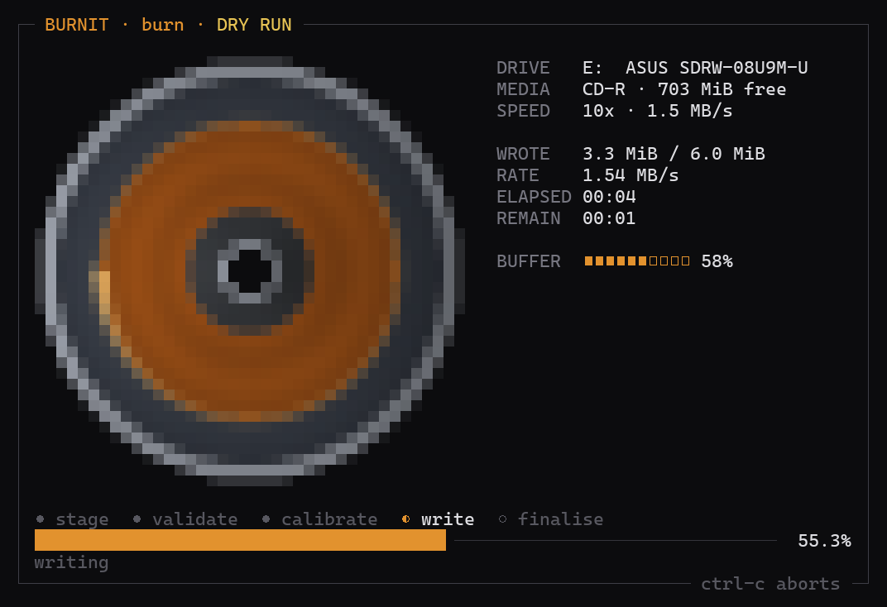
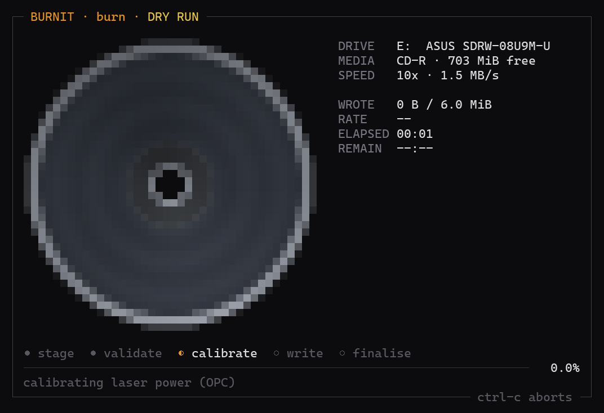
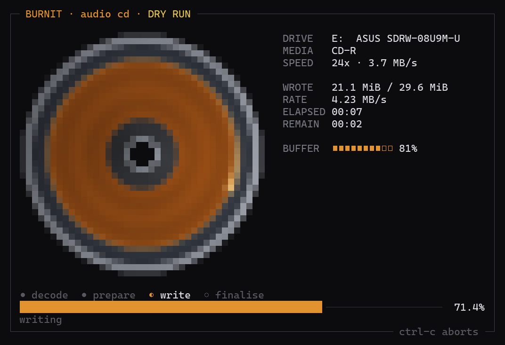
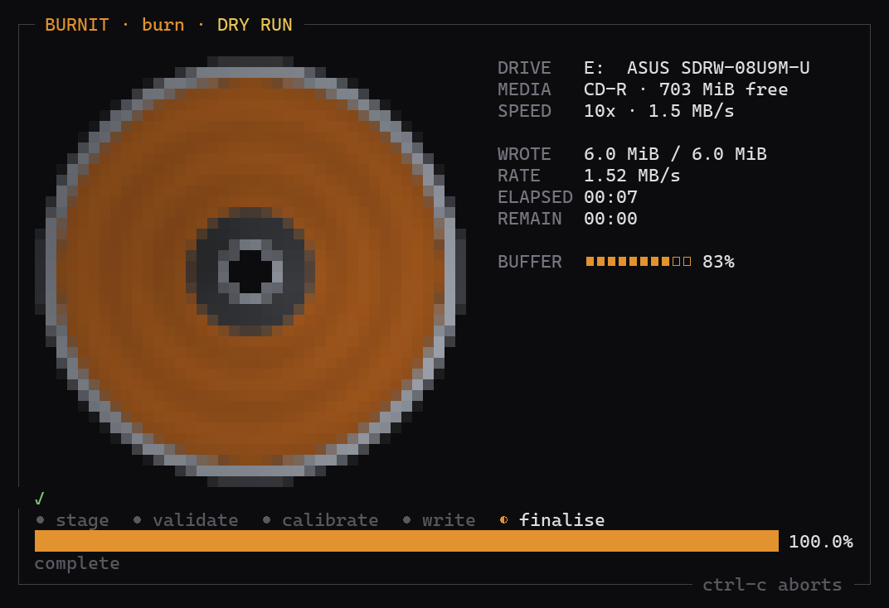
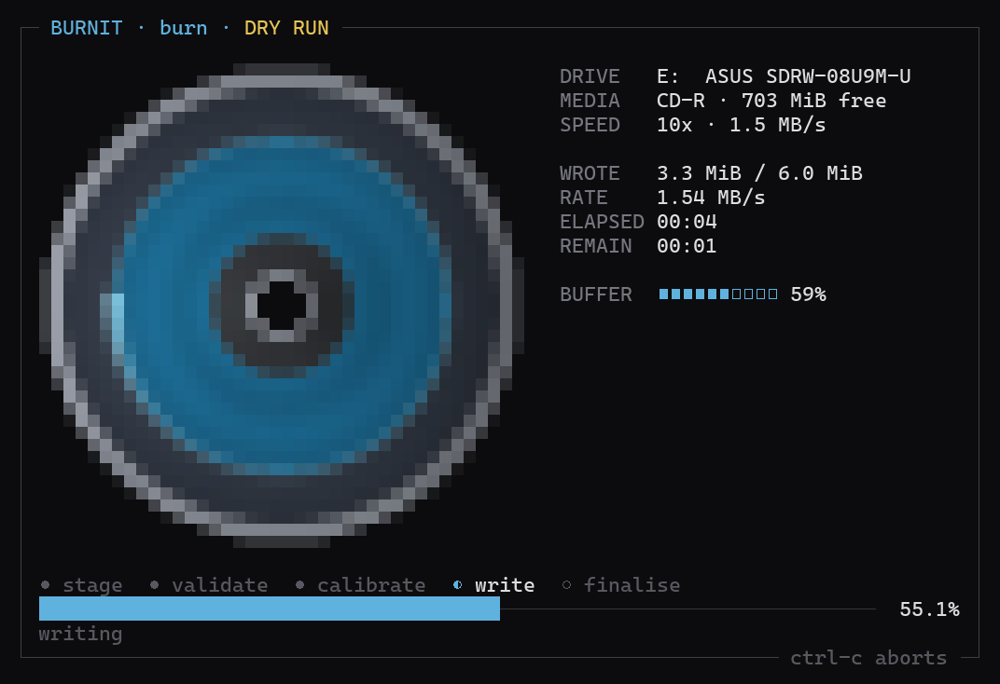
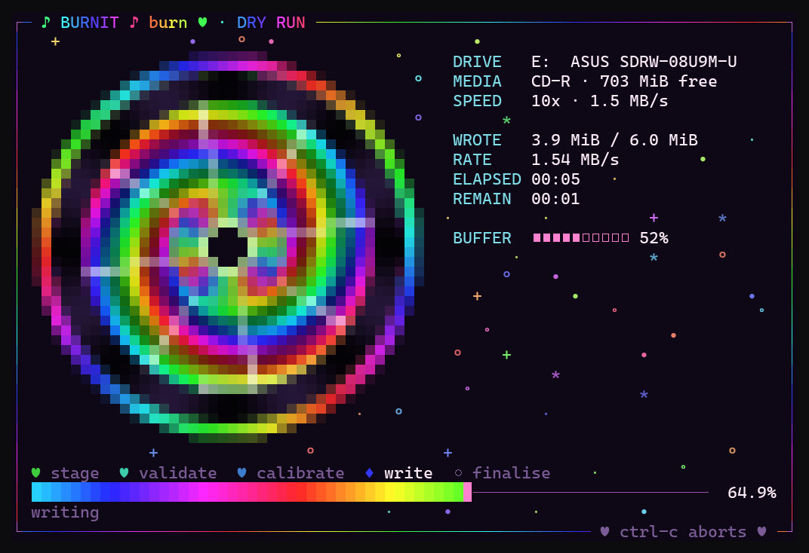

# burnit

Burn CD, DVD and Blu-ray discs from the terminal, on Windows, with a front end that
actually shows you what the laser is doing.



This is a real burner. It drives Windows' own **IMAPI2** engine — the same one
Explorer's "Burn to disc" uses — so a disc written by `burnit` is an ordinary
ISO 9660 / Joliet / UDF disc, and an audio CD written by `burnit` plays in a car
stereo. Nothing here shells out to a bundled `cdrecord`.

---

## Contents

- [Install](#install)
- [Commands](#commands)
- [What it looks like](#what-it-looks-like)
- [Verification](#verification)
- [How it works](#how-it-works)
- [Limitations](#limitations)

---

## Install

Requires Windows with .NET Framework 4.x, which every Windows 10/11 machine
already has. No SDK, no NuGet, no build tools needed.

```powershell
git clone git@github.com:voxelocity/burnit-CLI.git
cd burnit-CLI
.\build.ps1
```

That produces `dist\burnit.exe` — a single self-contained executable. Put it on
your `PATH` and you are done.

`ffmpeg` on `PATH` is optional; it is only needed to burn audio CDs from
anything that is not already a 44.1 kHz 16-bit stereo WAV.

---

## Commands

```
burnit drives                    list optical recorders and what is in them
burnit info                      everything the drive knows about the loaded disc
burnit burn <path>...            burn files and folders as a data disc
burnit iso <image.iso>           write an existing disc image
burnit audio <track>...          burn a Red Book audio CD
burnit spotify <url|search>...   fetch with spotdl, then burn it as an audio CD
burnit image <out.iso> <path>... build an ISO file without burning anything
burnit erase                     blank a CD-RW / DVD-RW / BD-RE
burnit eject | close             open or close the tray
```

| option | what it does |
| --- | --- |
| `-d, --drive <E:\|0>` | which recorder to use (default: the only one, or the first with a letter) |
| `-s, --speed <8x\|max\|min>` | write speed, snapped to the nearest the drive actually supports |
| `-l, --label <name>` | volume label |
| `--verify` | read the disc back and compare SHA-256 |
| `--close` | close the disc so nothing more can be added |
| `--append` | add a session to a disc that already has data |
| `--fs <iso,joliet,udf>` | which filesystems to generate |
| `--no-finalise` | audio: leave the disc open for more tracks later |
| `--full` | erase: full blank instead of quick |
| `--eject` | eject when finished |
| `--dry-run` | do everything except fire the laser |
| `-y, --yes` | skip the confirmation prompt |
| `--theme <amber\|ice\|mono>` | palette |
| `--plain` | no animation, one progress line at a time |

### Examples

```bash
burnit drives
burnit burn ./photos --label HOLIDAY --verify --eject
burnit iso ./debian.iso --speed 8x --verify
burnit audio *.flac --speed max
burnit image out.iso ./project          # no disc required
burnit burn ./more-files --append       # second session on the same disc
```

Nothing destructive happens without a confirmation prompt, or an explicit `-y`.

### `burn` vs `audio` — the one that catches everyone

`burn` makes a **data disc**: the files go on the disc as files. `audio` makes a
**Red Book audio CD**: the music is decoded to raw PCM and written as CD-DA
tracks.

```bash
burnit burn  ./music     # a disc holding .flac FILES  -> will not play in a CD player
burnit audio ./music     # a disc that plays in any CD player
```

A car stereo, a hi-fi CD player or a CD changer reads CD-DA only. Most cannot
read MP3, and none read FLAC. If you hand `burn` a set of files that are all
audio, it will say so before it writes anything.

`audio` takes a folder or a list of files. A folder is expanded to the audio
files inside it in filename order; pass files individually if you want a
specific running order.

### Spotify

`burnit spotify` hands a URL or a search to [spotdl](https://github.com/spotDL/spotify-downloader),
then burns what comes back as an audio CD:

```bash
burnit spotify https://open.spotify.com/playlist/37i9dQ... --speed 16x --eject
burnit spotify "kettama yosemite" --keep ./downloads
burnit spotify <album-url> --data --label MIXTAPE     # data disc of MP3s instead
```

spotdl runs with its stdio inherited, so you see its own progress live. Track
order comes from the playlist: files are named with their list position and
sorted numerically, so track 10 lands after track 2 rather than after track 1.

`--keep <dir>` leaves the downloads behind instead of using a temp folder; when
that folder already contains music, only what this run fetched gets burned.
`--data` writes the files as a data disc — useful for a head unit that reads
MP3, useless for one that does not.

Needs `pip install spotdl` and ffmpeg on `PATH`. A `.cmd`/`.bat` shim (pipx,
conda) is resolved correctly, not just `spotdl.exe`.

**For older head units** (BMW E46, anything pre-2006): use CD-R rather than
CD-RW — many old units cannot read the lower reflectivity of rewritables at all
— burn at `--speed 16x` or slower, and let it finalise (do not pass
`--no-finalise`). "Music"/"Audio" CD-Rs work fine; they are ordinary CD-R with a
flag set, and this tool writes them like any other disc.

---

## What it looks like

The disc is drawn with half-block characters, two pixels per character cell, so it
comes out round in a terminal's 1:2 cells and is supersampled to keep the rim
smooth. The burn front advances by **area**, not radius — which is how a disc
really fills up, and why the ring crawls at the start and races at the end.

The one effect that carries the whole thing is the write head: it rides the burn
front at the current angle with a short trail decaying behind it.

**Before the burn starts** — validating media and calibrating laser power. The
drive is spinning but nothing is being written yet:



**Mid-burn.** Everything on the right is read live from the drive, including the
write buffer level — if that number falls toward zero, your burn is about to
underrun:


**Audio CD.** Tracks are decoded to Red Book PCM, padded to the 4-second minimum
and laid out with 2-second gaps before anything is written:



**Finished:**



There are three palettes. `--theme ice`:



And then there is `--kawaii`:

```bash
burnit burn ./photos --kawaii
```



Rainbow spiral dye, rotating laser spokes, a hue-chasing frame, a scrolling
rainbow progress bar and a twinkling sparkle field. The disc spins at twice the
normal rate and everything pulses on a four-to-the-floor beat. `--rave` is an
alias. The write head still tracks real bytes — it is the same burn underneath,
just louder.

Glyphs are restricted to what Cascadia Mono actually ships, because font
fallback substitutes double-width characters and shears the whole grid.

If stdout is not a terminal, or you pass `--plain`, it degrades to plain progress
lines instead.

---

## Verification

`--verify` is not a checkbox that prints "OK". It:

1. hashes the exact byte stream that is about to be written (SHA-256),
2. burns it,
3. reopens the drive as a **raw block device** (`\\.\E:`) and reads the same
   number of bytes straight back off the disc,
4. hashes that and compares.

If the two differ it tells you, prints both digests, and exits non-zero. It never
claims a burn is good because the drive did not report an error.

---

## How it works

The interesting part is the COM plumbing, because IMAPI2 is awkward to reach from
managed code and most of the awkwardness is invisible until a burn silently runs
blind.

**Late binding for calls.** Every IMAPI2 call goes through `IDispatch` via C#
`dynamic`. There are no hand-transcribed vtable layouts, so there is no way to get
a method slot subtly wrong and corrupt memory on a drive operation.

**Hand-declared interfaces only where we must implement one.** Write progress
arrives through a COM *connection point*: IMAPI2 calls back into an object we
supply. Those four sink interfaces are the only ones declared by hand, and their
IIDs and DISPIDs were read out of the type libraries in `imapi2.dll` and
`imapi2fs.dll` (`FUNCDESC.memid`) rather than copied from memory:

| sink | IID | DISPID |
| --- | --- | --- |
| `DDiscFormat2DataEvents` | `2735413C-…` | `0x200` |
| `DDiscFormat2TrackAtOnceEvents` | `2735413F-…` | `0x200` |
| `DDiscFormat2EraseEvents` | `2735413A-…` | `0x200` |
| `DFileSystemImageEvents` | `2C941FDF-…` | `0x100` |

They are declared *dual*, so the callable wrapper answers both a vtable call and
`IDispatch::Invoke` — IMAPI2 is scriptable and may legitimately use either.

**Why .NET Framework.** This targets .NET Framework 4.x on purpose. .NET Core and
later do not give a managed object an automatic `IDispatch` implementation, and
`IDispatch` is exactly what the burn engine calls back into. On .NET 8 the burn
would run with a dead progress sink.

**No managed object in the data path.** Bytes reach the drive as a native
`IStream` — from `IFileSystemImageResult`, from `MsftIsoImageManager`, or from
`SHCreateStreamOnFileEx` — so the write engine's own buffering is never disturbed
by garbage collection mid-burn.

**`--dry-run` really advises the sink.** It attaches the connection point for
real before simulating, so if the callback wiring is broken the dry run is what
tells you, not a wasted disc.

**Rendering.** Frames are composed into a cell grid and flushed as a per-row diff,
so only the part of the screen that moved is written and the screen is never
cleared — which is what causes flicker. The render thread runs independently of
IMAPI2's progress callbacks, which only arrive once or twice a second; the disc
keeps spinning between them, and only the burn front waits for real data.

### Layout

```
src/Interop.cs     COM declarations, event sink interfaces, IMAPI2 enums
src/Native.cs      console VT mode, file-as-IStream, raw device reads
src/Devices.cs     drive enumeration, media inspection, speed negotiation
src/Sinks.cs       the four IMAPI2 event sinks
src/Burn.cs        image staging, writing, read-back verification
src/Audio.cs       Red Book decode and track layout
src/Commands.cs    the verbs
src/Term.cs        truecolor cell grid with diff flushing
src/DiscWidget.cs  the disc
src/Dashboard.cs   live burn dashboard
src/Program.cs     argument parsing
```

---

## Limitations

- **Windows only.** IMAPI2 is a Windows API; there is no Linux or macOS path.
- **No ripping.** This writes discs, it does not read them into files (beyond
  read-back for verification).
- **Audio verification is not supported** — CD-DA has no byte-exact read-back
  through the block device, so `--verify` covers data and ISO burns.
- **Erase needs rewritable media.** CD-R and DVD±R are write-once; the tool will
  say so rather than pretending.
- Burning generally wants the drive not to be locked by Explorer or an indexer.
  If a burn fails with a lock error, closing any window showing the disc is
  usually enough.

---

## Licence

MIT.
